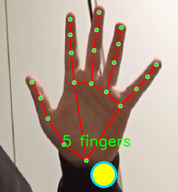

# Hands Detector (English)

A hand detection app that uses your webcam to track your hands. Includes a couple of games you can play with hand gestures.

This app uses **MediaPipe** for hand tracking, which provides real-time hand detection and landmark tracking.



## Requirements

- **Python 3.11** (other versions might work but 3.11 is tested)
- **Windows** (Linux/Mac support coming later)
- A webcam

## Installation

### Step 1: Install Python dependencies

Open a terminal in the project folder and run:

```bash
pip install -r requirements.txt
```

If `pip` doesn't work, try using Python directly:

```bash
python -m pip install -r requirements.txt
```

Or if Python isn't in your PATH, use the full path:

```bash
F:\Python-311\python.exe -m pip install -r requirements.txt
```

This will install:
- MediaPipe (hand detection)
- OpenCV (camera and video processing)
- NumPy (math stuff)
- Pygame (sound for piano game)

### Step 2: Configure Python path

If Python isn't in your system PATH, you need to tell the script where to find it:

1. Open `run.bat` in a text editor
2. Look for the line that says `F:\Python-311\python.exe` (around line 20)
3. Replace `F:\Python-311\python.exe` with your actual Python installation path
4. Save the file

The script will try to find Python automatically, but if it fails, this is your backup.

### Step 3: Configure games (optional)

Open `config.json` and you'll see a `GAMES` section:

```json
"GAMES": {
    "piano_game": false,
    "coins_game": true
}
```

- Set `piano_game` to `true` to play the piano with your fingers
- Set `coins_game` to `true` to play the coin collecting game

**Important**: Only enable **one game at a time**. Enabling multiple games simultaneously can cause bugs and weird behavior.

### Step 4: Enable GPU mode (recommended)

For better performance and smoother tracking, it's recommended to enable GPU mode. In `config.json`, set:

```json
"gpu_mode": true
```

This will use your GPU to accelerate MediaPipe's hand detection, making the app run much more smoothly. If you don't have a compatible GPU or experience issues, you can set it to `false` to use CPU mode instead.

## Running the App

### Option 1: Double-click `run.bat`

The easiest way. Just double-click the `run.bat` file and it should start.

### Option 2: Command line

```bash
python main.py
```

Or if Python isn't in PATH:

```bash
F:\Python-311\python.exe main.py
```

## Controls

While the app is running:

- **`q`** - Quit the application
- **`d`** or **Right Arrow** - Switch to next camera (if you have multiple)
- **`a`** or **Left Arrow** - Switch to previous camera
- **`0-9`** - Select a specific camera by number

## Games

### Piano Game

When enabled, each finger plays a different note. Lower your fingers to play notes. Each hand has 5 different notes (10 total).

### Coins Game

Collect yellow coins with your hands while avoiding the black bouncing ball. Each coin gives you 1 point. Touch the black ball and you lose - the game will restart automatically after 5 seconds.

## Troubleshooting

- **Camera not found**: Make sure your webcam is connected and not being used by another app
- **Python not found**: Check the Python path in `run.bat` or add Python to your system PATH
- **Import errors**: Make sure you installed all requirements with `pip install -r requirements.txt`
- **Games not working**: Make sure only one game is enabled in `config.json`

---

# Hands Detector (Español)

Una aplicación de detección de manos que usa tu webcam para rastrear tus manos. Incluye un par de juegos que puedes jugar con gestos de manos.

Esta aplicación usa **MediaPipe** para el seguimiento de manos, que proporciona detección de manos y seguimiento de puntos de referencia en tiempo real.

## Requisitos

- **Python 3.11** (otras versiones podrían funcionar pero 3.11 está probado)
- **Windows** (soporte para Linux/Mac próximamente)
- Una webcam

## Instalación

### Paso 1: Instalar dependencias de Python

Abre una terminal en la carpeta del proyecto y ejecuta:

```bash
pip install -r requirements.txt
```

Si `pip` no funciona, intenta usar Python directamente:

```bash
python -m pip install -r requirements.txt
```

O si Python no está en tu PATH, usa la ruta completa:

```bash
F:\Python-311\python.exe -m pip install -r requirements.txt
```

Esto instalará:
- MediaPipe (detección de manos)
- OpenCV (cámara y procesamiento de video)
- NumPy (operaciones matemáticas)
- Pygame (sonido para el juego de piano)

### Paso 2: Configurar la ruta de Python

Si Python no está en el PATH de tu sistema, necesitas indicarle al script dónde encontrarlo:

1. Abre `run.bat` en un editor de texto
2. Busca la línea que dice `F:\Python-311\python.exe` (alrededor de la línea 20)
3. Reemplaza `F:\Python-311\python.exe` con la ruta real de tu instalación de Python
4. Guarda el archivo

El script intentará encontrar Python automáticamente, pero si falla, esta es tu opción de respaldo.

### Paso 3: Configurar juegos (opcional)

Abre `config.json` y verás una sección `GAMES`:

```json
"GAMES": {
    "piano_game": false,
    "coins_game": true
}
```

- Establece `piano_game` en `true` para tocar el piano con tus dedos
- Establece `coins_game` en `true` para jugar al juego de recolección de monedas

**Importante**: Solo habilita **un juego a la vez**. Habilitar múltiples juegos simultáneamente puede causar errores y comportamientos extraños.

### Paso 4: Habilitar modo GPU (recomendado)

Para mejor rendimiento y seguimiento más fluido, se recomienda habilitar el modo GPU. En `config.json`, establece:

```json
"gpu_mode": true
```

Esto usará tu GPU para acelerar la detección de manos de MediaPipe, haciendo que la aplicación funcione mucho más suavemente. Si no tienes una GPU compatible o experimentas problemas, puedes establecerlo en `false` para usar el modo CPU en su lugar.

## Ejecutar la Aplicación

### Opción 1: Doble clic en `run.bat`

La forma más fácil. Simplemente haz doble clic en el archivo `run.bat` y debería iniciarse.

### Opción 2: Línea de comandos

```bash
python main.py
```

O si Python no está en PATH:

```bash
F:\Python-311\python.exe main.py
```

## Controles

Mientras la aplicación está en ejecución:

- **`q`** - Salir de la aplicación
- **`d`** o **Flecha Derecha** - Cambiar a la siguiente cámara (si tienes múltiples)
- **`a`** o **Flecha Izquierda** - Cambiar a la cámara anterior
- **`0-9`** - Seleccionar una cámara específica por número

## Juegos

### Juego de Piano

Cuando está habilitado, cada dedo toca una nota diferente. Baja tus dedos para tocar notas. Cada mano tiene 5 notas diferentes (10 en total).

### Juego de Monedas

Recolecta monedas amarillas con tus manos mientras evitas la pelota negra que rebota. Cada moneda te da 1 punto. Toca la pelota negra y pierdes - el juego se reiniciará automáticamente después de 5 segundos.

## Solución de Problemas

- **Cámara no encontrada**: Asegúrate de que tu webcam esté conectada y no esté siendo usada por otra aplicación
- **Python no encontrado**: Verifica la ruta de Python en `run.bat` o agrega Python al PATH de tu sistema
- **Errores de importación**: Asegúrate de haber instalado todos los requisitos con `pip install -r requirements.txt`
- **Los juegos no funcionan**: Asegúrate de que solo un juego esté habilitado en `config.json`

